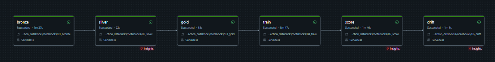
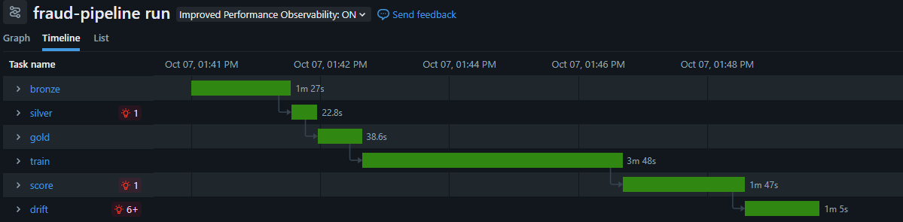

# Fraud detection on Databricks


A batch fraud detection pipeline built on Databricks Free Edition with PySpark, Delta Lake and MLflow, trained on the [IEEE-CIS Fraud Detection](https://www.kaggle.com/competitions/ieee-fraud-detection) dataset (590,540 card-not-present transactions, 3.5% fraud).

It follows on from [fraud-detection-system](https://github.com/liamhavers/fraud-detection-system), which covers credit card fraud with XGBoost, FastAPI, Docker and PSI drift monitoring on a single machine. This project rebuilds the IEEE-CIS side of that work as a Spark pipeline: Delta tables for each stage, past-only velocity features with window functions, a time-based split with a label-delay gap, a model registered in Unity Catalog with champion and challenger aliases, batch scoring, and weekly drift monitoring, all run as one scheduled Databricks Job.

## Results

On the test split (the last 15% of the data by time, 88,582 transactions, 3,083 frauds):

| Metric | Value |
|---|---|
| PR-AUC | **0.527** (base rate 0.035) |
| Threshold | 0.025, chosen on the `early_stop` split |
| Recall | 74.9% |
| Precision | 20.4% |
| Cost (missed fraud = 100, false alarm = 5) | 122,600 against 308,300 for flagging nothing, a **60.2% reduction** |

These numbers are not comparable with the earlier repo's headline PR-AUC of 0.798 (a different dataset, the Kaggle credit card data) or its IEEE-CIS PR-AUC of 0.497 (a different split and feature set).

PR-AUC on the `early_stop` split was 0.671, so performance dropped by about 0.14 between the validation period and the test month. The [drift section](#drift) looks at why.

## Architecture

```
Kaggle CSVs -> UC volume -> bronze (raw Delta) -> silver (joined, clean, event_ts)
  -> gold (velocity + frequency features) -> train XGBoost on driver -> MLflow model (@champion)
  -> batch scoring (spark_udf) -> scores table -> weekly PSI drift table
```

All tables live in the Unity Catalog schema `workspace.fraud`. The model is registered as `workspace.fraud.fraud_xgb`.

The six notebooks run as one Databricks Job on serverless compute, each task starting when the previous one succeeds:





| Task | Notebook | Writes | Rows | Runtime in the job |
|---|---|---|---|---|
| bronze | `01_bronze` | `bronze_train_transaction`, `bronze_train_identity` | 590,540 and 144,233 | 1m 27s |
| silver | `02_silver` | `silver_transactions` (98 columns) | 590,540 | 23s |
| gold | `03_gold` | `gold_features` (139 columns) | 590,540 | 39s |
| train | `04_train` | MLflow run, model version, alias | 413,377 train, 59,054 early stop, 88,582 test | 3m 48s |
| score | `05_score` | `scores` | 590,540 | 1m 47s |
| drift | `06_drift` | `drift_psi` | one row per week and monitored column | 1m 5s |

The whole job takes about 9 minutes. Runtimes include serverless start-up and `%pip` installs for each task.

Logic lives in the `fraud/` package as pure functions (DataFrame in, DataFrame out) with unit tests that run on local PySpark. The notebooks read a table, call those functions, check the result and write a table.

## Design decisions

### Time-based split with a gap

The split comes from exact quantiles of `TransactionDT` (`fraud/splits.py`):

| Split | Share of time range | Used for |
|---|---|---|
| `train` | first 70% | fitting the model |
| `early_stop` | 70% to 80% | early stopping, threshold choice, champion comparison |
| `gap` | 80% to 85% | nothing |
| `test` | last 15% | final metrics only |

A random split would let the model train on transactions that happened after the ones it is tested on. In production a model only ever scores the future, so the test period comes after everything it was trained on.

The gap stands in for label delay. Fraud labels arrive through chargebacks, weeks after the transaction, so on the day a model is retrained its most recent data does not yet have reliable labels. Leaving 11 days unused between `early_stop` and `test` means the model is tested some time after its newest training labels. Real chargeback windows are often longer than this.

The threshold and the champion comparison both use `early_stop`, never `test`, so the test score is not tuned to the test set. Transactions with the same timestamp always land in the same split.

### Past-only velocity windows

For each `card1`, `03_gold` adds the count and total amount of earlier transactions in the last hour, day and week, and the seconds since the previous transaction. The windows use `rangeBetween(-secs, -1)` ordered by `TransactionDT`:

- `rangeBetween`, not `rowsBetween`, because the window is a span of time, not a number of rows.
- The frame ends at `-1`, so a transaction never sees itself, or any other transaction in the same second, whose order is unknown.
- `secs_since_last` uses `max(TransactionDT)` over `rangeBetween(unboundedPreceding, -1)` rather than `lag()`, so it follows the same strictly-earlier rule as the counts.

All seven columns share one `partitionBy` and `orderBy`, so Spark plans a single shuffle and sort for all of them. This was confirmed in the query plan (one `Window` operator, one `hashpartitioning(card1)` exchange).

### Null guard

Spark puts every null key into one window partition, so transactions with a missing key would otherwise share a made-up history. Every window feature is wrapped in `F.when(key.isNotNull(), ...)` and returns null for a null key. The frequency joins need no guard: an equi-join never matches a null key.

### Broadcast joins

- **Silver** joins identity (144,233 rows) onto transactions with a left join and records a `has_identity` flag. Fraud is 7.8% with an identity record and 2.1% without. The optimizer chose a broadcast hash join without a hint, from the Delta table statistics, so the 590k-row side was never shuffled.
- **Gold** frequency-encodes 37 categorical columns. Each count table is built with `groupBy().count()`, which aggregates within each partition before the shuffle, and is joined back with `F.broadcast()`. The plan shows 37 broadcast hash joins and no sort-merge joins.

### Skew

The velocity windows put all rows for one `card1` value in one task. The busiest value has 14,932 rows, about 26 times the average shuffle partition. The whole gold stage runs in under a minute, so this was measured and left alone. At a larger scale, a finer key would be the fix. AQE's skew handling applies to joins, not windows, and salting would break a time-ordered window by splitting one card's history.

### Driver training

The filtered feature table (about 560k rows by 106 double columns, roughly 0.5 GB) is collected with `toPandas()` and trained with XGBoost's `hist` method on the driver. That took 16 seconds to collect and about 3 minutes to train. Distributed training (`SparkXGBClassifier`) would add complexity for no gain at this size. `toPandas()` is only called on the finished, filtered table, because it pulls every row into driver memory.

Other modelling choices:

- Features are cast to `double` in both training and scoring, to match the logged MLflow signature. One function, `feature_cols()`, gives the feature list for both.
- Early stopping on `early_stop` PR-AUC stopped at 846 trees out of a maximum of 2,000.
- No class weighting. The imbalance is handled by the cost-based threshold, so the scores stay close to real probabilities.
- The model is logged as a small `pyfunc` wrapper that returns the fraud probability. The plain XGBoost flavour's `predict` returns 0/1 labels at a 0.5 cut.

### Champion and challenger

Scoring always loads `models:/workspace.fraud.fraud_xgb@champion`. A new version becomes `champion` only if its `early_stop` PR-AUC beats the current champion's. Otherwise it gets the `challenger` alias. Promoting or rolling back a model means moving an alias, with no change to the scoring code. In the scheduled job, a retrain on unchanged data produced an identical score and was registered as a challenger, leaving the champion in place.

### Scoring check

`05_score` checks that the feature list matches the model signature, scores every row with `mlflow.pyfunc.spark_udf`, and then recomputes test PR-AUC from the `scores` table. It matched the training run to six decimal places (0.527033), which rules out a mismatch between how features are prepared for training and for scoring.

## Drift

`06_drift` computes the Population Stability Index (PSI) each week for the model score and the 10 most important features, against the training period. Bucket edges are the training period's deciles, and nulls get their own bucket, so a change in how often a value is missing counts as drift.

What it found:

- **Christmas.** The only major shifts (PSI above 0.25) are in the week of 22 December 2017. That week has 37,251 transactions, about double a normal week, and `C4`, `id_35_freq`, `id_17`, `C8` and `C10` all have PSI above 0.35. This also supports the assumed start date for the timestamps.
- **The test weeks are stable.** In the test weeks the score's PSI never goes above 0.014 and no monitored feature goes above 0.056, all well under the 0.1 line, even though PR-AUC fell from 0.67 to 0.53 between validation and test. PSI only detects changes in the inputs (covariate shift). A drop in performance without a matching shift in the inputs points to a change in how inputs relate to fraud (concept drift), which needs labels to see. PSI is the early warning because it needs no labels; precision and recall confirm the effect once chargebacks arrive.
- **Calibration drifts too.** On the training data the mean score (0.0351) matches the fraud rate (0.0352). On later data the model predicts about 25% too little fraud (mean score 0.0265 against a fraud rate of 0.0348). This is why the cost-optimal threshold (0.025) is about half the value a calibrated model would use (5 / 105, about 0.048), and why the threshold is chosen on recent held-out data.
- **Precision follows the base rate.** Across the test weeks, recall stays between 73% and 76% while precision rises from 18% to 24% as the fraud rate rises from 2.8% to 4.3%. A weekly fall in precision on its own does not mean the model got worse.

## Feature importance

By XGBoost gain, the top features are `C7`, `id_35_freq`, `C4`, `C8`, `C14`, `id_17`, `id_22`, `C10`, `addr2` and `C5`. The `C` columns are counts provided by Vesta (for example, how many addresses are linked to a card), which act as velocity features built with more history and better keys than this pipeline has. None of the `card1` velocity features made the top 10. `card1` is a coarse key (13,553 values across 590k transactions), and a better card or customer key is the most likely way to make them useful.

## Polars and Spark

The earlier repo ran the same dataset through polars on one machine: the full IEEE-CIS pipeline from CSV to features took about 3 seconds on 8 cores. This pipeline takes about 9 minutes as a Databricks Job. These measure different work and are not a like-for-like benchmark, but the gap is real.

- At 590k rows and about 700 MB of CSV, the data fits comfortably in memory on one machine, and polars is faster and simpler. Spark pays for shuffles, task scheduling, JVM-to-Python transfers in the scoring UDF, and serverless start-up for each task.
- Spark is the right tool once the data no longer fits on one machine, or when the work has to run on shared, governed infrastructure. Most of what this project shows is in that second category: ACID Delta tables with time travel, Unity Catalog permissions and lineage, a model registry with aliases, and a scheduled job with retries and repair runs.
- The code is written the way it would need to be at scale: no collecting to pandas before the final training table, past-only windows that do not depend on row order, broadcast joins for small lookups, and checks on the query plan for unexpected shuffles.

## Known limitations

- **Timestamps.** `TransactionDT` is seconds from an unpublished reference point. `event_ts` assumes 2017-12-01 00:00 UTC, the date the Kaggle community inferred from holiday patterns. The Christmas spike in the drift results lines up with that assumption, but it is not confirmed.
- **Frequency encodings use the full dataset**, including the test period. No labels are involved, but it is a small leak of future information. They should be computed from the training window only.
- **`card1` is not a card.** Many real cards share each value, so the velocity features are velocities of a group of cards.
- **Raw category codes are features.** `card1`, `addr1` and similar codes are used as numbers as well as through their frequency encodings. Trees can split on them, but the model may memorise specific IDs, which may contribute to the drop between validation and test.
- **The gap is short.** 11 days is shorter than many real chargeback windows.
- **Full rebuild every run.** Each job run re-reads the CSVs and overwrites every table. A production pipeline would ingest new files incrementally and score only new transactions.
- **Retraining on every run.** Each scheduled run registers a new model version, even when the data has not changed. In production, retraining would be triggered by new labelled data or by the drift monitor.
- **Selective labels.** In a live system, transactions that were declined never get a fraud label, so the training data depends on the previous model's decisions. This dataset does not show that effect, but a deployed version would need to account for it.
- **V columns are not used.** The 339 Vesta `V` columns were left out to keep the feature set explainable.

## Repo structure

```
fraud/
  features.py      add_velocity_features, add_frequency_features, CAT_COLS
  splits.py        NON_FEATURES, feature_cols(), cutoffs(), with_split()
  drift.py         with_week(), quantile_edges(), bucket(), weekly_psi()
notebooks/
  01_bronze.py  02_silver.py  03_gold.py  04_train.py  05_score.py  06_drift.py
tests/
  conftest.py      local SparkSession (local[1])
  test_features.py  test_splits.py  test_drift.py
docs/images/       job screenshots
.github/workflows/tests.yml
requirements-dev.txt
```

## Running it

### Tests (local)

Needs Python 3.11 or later and Java 21 (PySpark 4.x).

```bash
python -m venv venv
source venv/bin/activate
pip install -r requirements-dev.txt
pytest -q
```

The tests use small hand-built DataFrames with known expected values and never need a Databricks connection. GitHub Actions runs them on every push.

### Data

The data is not in this repo. The Kaggle competition rules forbid redistribution.

1. Accept the rules at [kaggle.com/competitions/ieee-fraud-detection/rules](https://www.kaggle.com/competitions/ieee-fraud-detection/rules).
2. Download and unzip:

```bash
kaggle competitions download -c ieee-fraud-detection -p data
python -c "import zipfile; zipfile.ZipFile('data/ieee-fraud-detection.zip').extractall('data')"
```

Only `train_transaction.csv` and `train_identity.csv` are used. The `test_*` files have no labels.

### Databricks

On Databricks Free Edition (serverless compute only):

1. Create the schema and volume:

```sql
CREATE SCHEMA IF NOT EXISTS workspace.fraud;
CREATE VOLUME IF NOT EXISTS workspace.fraud.raw;
```

2. Upload the two training CSVs to `/Volumes/workspace/fraud/raw/`.
3. Add this repo as a Git folder (Workspace, Create, Git folder).
4. Run the notebooks in order, or create a Job with one notebook task per notebook, each depending on the one before.

## Possible extensions

- A customer key (`card1` + `addr1` + `event_day - D1`) for the velocity features.
- Frequency maps built from the training window only.
- A selected subset of the `V` columns.
- `SparkXGBClassifier` for distributed training.
- The job defined as a Databricks Asset Bundle, so its definition lives in the repo.
